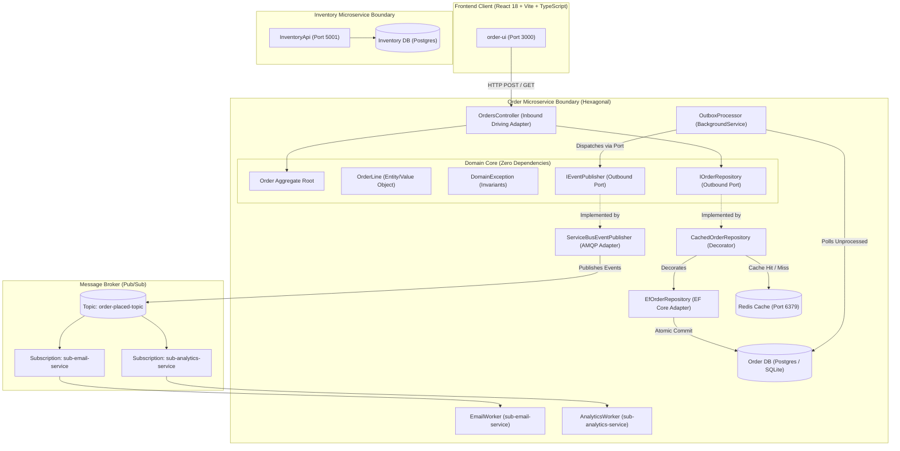
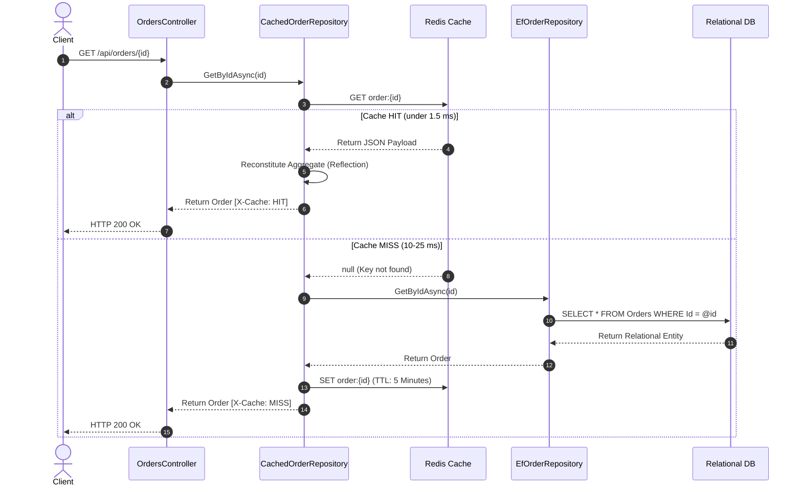
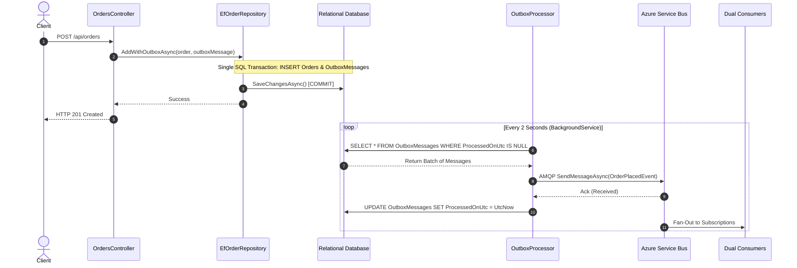

# Hexagonal Microservices Reference Architecture (.NET 8 & React)

An enterprise reference implementation and educational guide demonstrating **Hexagonal Architecture (Ports & Adapters)**, the **Database-per-Service** pattern, **Event-Driven Pub/Sub Messaging** (Azure Service Bus), **Distributed Caching** (Redis Cache-Aside via Decorator), the **Transactional Outbox Pattern** (solving the Dual-Write problem), and a strongly-typed **React TypeScript** frontend.

---

## Table of Contents

1. [Architectural Overview](#architectural-overview)
2. [Core Theoretical Concepts](#core-theoretical-concepts)
   - [1. Hexagonal Architecture (Ports & Adapters)](#1-hexagonal-architecture-ports--adapters)
   - [2. Database-per-Service & Network Isolation](#2-database-per-service--network-isolation)
   - [3. Event-Driven Messaging & Dual Consumers](#3-event-driven-messaging--dual-consumers)
   - [4. Distributed Caching (Cache-Aside Decorator)](#4-distributed-caching-cache-aside-decorator)
   - [5. The Dual-Write Problem & Transactional Outbox](#5-the-dual-write-problem--transactional-outbox)
   - [6. At-Least-Once Delivery & Consumer Idempotency](#6-at-least-once-delivery--consumer-idempotency)
   - [7. Resilient Frontend Architecture](#7-resilient-frontend-architecture)
3. [End-to-End System Topology](#end-to-end-system-topology)
4. [Codebase Navigation Guide](#codebase-navigation-guide)
5. [Step-by-Step Execution Guide](#step-by-step-execution-guide)
   - [Prerequisites](#prerequisites)
   - [Step 0: Run the Unit Tests](#step-0-run-the-unit-tests)
   - [Option A: Hybrid Developer Mode (Recommended)](#option-a-hybrid-developer-mode-recommended-for-active-development)
   - [Option B: Full Containerized Mode (Docker Compose)](#option-b-full-containerized-microservices-mode-docker-compose)
6. [Interactive Learning Scenarios](#interactive-learning-scenarios)
   - [Scenario A: Cache-Aside Latency Benchmark (MISS vs. HIT)](#scenario-a-cache-aside-latency-benchmark-miss-vs-hit)
   - [Scenario B: The Dual-Write Anomaly Demonstration](#scenario-b-the-dual-write-anomaly-demonstration)
   - [Scenario C: Transactional Outbox & Resilient Dispatch](#scenario-c-transactional-outbox--resilient-dispatch)
7. [Production Gotchas & Troubleshooting Reference](#production-gotchas--troubleshooting-reference)
8. [Enterprise Best Practices Implemented](#enterprise-best-practices-implemented)

---

## Architectural Overview

This repository demonstrates the migration of a tightly coupled monolithic baseline into decoupled, event-driven microservices.



---

## Core Theoretical Concepts

### 1. Hexagonal Architecture (Ports & Adapters)

In traditional 3-layer applications, the database and framework leak into business logic (e.g., controllers returning `DbContext` entities, services containing SQL queries, or mocking entire ORMs for unit testing).

**Hexagonal Architecture places business rules at the absolute center:**
- **The Domain Core ([OrderApi.Domain](./OrderApi.Domain))**: Has **zero external dependencies** (no ASP.NET Core, no EF Core, no Azure SDK, no JSON attributes).
- **Aggregates & Invariants ([Order.cs](./OrderApi.Domain/Entities/Order.cs))**: The `Order` aggregate root guarantees consistency. An order can never exist in memory in an invalid state. Lines cannot be empty, customer names are validated, and total discounts (10% discount for orders over $100) are computed internally.
- **Ports**: Interfaces defined strictly in the domain's vocabulary:
  - `IOrderRepository`: Driven port for persistence.
  - `IEventPublisher`: Driven port for integration events.
- **Adapters**:
  - **Driving (Inbound)**: [OrdersController.cs](./OrderApi/Controllers/OrdersController.cs) translates incoming HTTP JSON payloads to domain commands.
  - **Driven (Outbound)**: [EfOrderRepository.cs](./OrderApi/Infrastructure/EfOrderRepository.cs) maps aggregates to relational tables using EF Core backing fields (`OwnsMany`).
- **Blazing Fast Testing ([OrderApplicationTests.cs](./OrderApi.Tests/OrderApplicationTests.cs))**: The core can be fully tested in **under 35 milliseconds** using a pure [InMemoryOrderRepository.cs](./OrderApi.Tests/Fakes/InMemoryOrderRepository.cs) fake without launching database containers or mocking frameworks.

---

### 2. Database-per-Service & Network Isolation

Microservices must strictly own their own data stores to prevent database-level coupling:
- **Order Microservice**: Communicates with its own database container (`order-db`, Postgres/SQLite).
- **Inventory Microservice ([InventoryApi](./InventoryApi))**: Runs in an isolated container communicating with `inventory-db`.
- Under no circumstances do services share connection strings, database instances, or cross-database foreign keys.
- Communication across boundaries happens via asynchronous events or internal Docker network DNS (`http://inventory-api:8080`).

---

### 3. Event-Driven Messaging & Dual Consumers

When an order is created, the system uses Pub/Sub fan-out on Azure Service Bus topic `order-placed-topic`:
- **Producer**: [ServiceBusEventPublisher.cs](./OrderApi/Infrastructure/Messaging/ServiceBusEventPublisher.cs) maintains a singleton `ServiceBusClient` (preventing AMQP socket exhaustion).
- **Consumer 1 ([EmailWorker.cs](./OrderApi/Workers/EmailWorker.cs))**: Listens to subscription `sub-email-service` and simulates customer notifications.
- **Consumer 2 ([AnalyticsWorker.cs](./OrderApi/Workers/AnalyticsWorker.cs))**: Listens to subscription `sub-analytics-service` and logs financial aggregation metrics.
- **Dual Support**: Fully functional against both the local **Azure Service Bus Emulator** (offline development) and **Azure Cloud Service Bus** via connection strings in [appsettings.json](./OrderApi/appsettings.json) and .NET User Secrets.

---

### 4. Distributed Caching (Cache-Aside Decorator)

To prevent database bottlenecking without polluting domain logic or modifying database repositories, we implemented the **Decorator Pattern** in [CachedOrderRepository.cs](./OrderApi/Infrastructure/Caching/CachedOrderRepository.cs):



- **Clean Reflection Reconstitution**: The aggregate root `Order` requires private constructors to preserve domain invariants. `CachedOrderRepository` reconstitutes the object via private reflection, guaranteeing zero domain modifications.
- **Mutation Invalidation**: When `AddWithOutboxAsync` is called, the decorator immediately invalidates `order:{id}` in Redis to eliminate stale reads.
- **Native Microsoft DI Registration**: Registered in [Program.cs](./OrderApi/Program.cs) using a clean factory delegate without external libraries.

---

### 5. The Dual-Write Problem & Transactional Outbox

A classic distributed systems trap occurs when a service attempts to write to a local database and publish to a message broker in the same HTTP request:

```csharp
// THE DUAL-WRITE ANTI-PATTERN:
await _orderRepository.AddAsync(order); // Step 1: Commits to SQL DB
await _eventPublisher.PublishAsync(orderPlacedEvent); // Step 2: Fails (network timeout / broker crash)
```

#### Why 2-Phase Commit (2PC) Fails in the Cloud:
Wrapping both in `TransactionScope` **does not work**:
1. Modern cloud brokers (Azure Service Bus, Kafka, RabbitMQ) and databases (Postgres, SQLite) do not share an MSDTC or XA distributed transaction coordinator.
2. Holding distributed locks across network boundaries violates the CAP theorem, causing thread pool starvation and cascading service failure.

#### The Solution: The Transactional Outbox Pattern
Both the business entity and the integration event are written to the **same local database transaction**:



---

### 6. At-Least-Once Delivery & Consumer Idempotency

The Transactional Outbox pattern guarantees **At-Least-Once Delivery**:
- If `OutboxProcessor` sends a message to the broker, but the application crashes before updating `ProcessedOnUtc = UtcNow`, the message will be dispatched again upon restart.
- **Consumer Idempotency** is mandatory. This codebase supports:
  1. **MessageId Deduplication**: Using `outboxMessage.Id` as `ServiceBusMessage.MessageId` (leveraging Azure Service Bus duplicate detection window).
  2. **Consumer Inbox Pattern**: Consumers track processed IDs in a local `InboxMessages` table to drop duplicates gracefully.
  3. **Natural Business Idempotency**: State machine transitions (`WHERE Status != 'PROCESSED'`).

---

### 7. Resilient Frontend Architecture

The [order-ui](./order-ui) single-page application is structured with strict separation of concerns:
- **Strict TypeScript Contracts ([order.types.ts](./order-ui/src/api/types/order.types.ts))**: No untyped `any` escapes; mirrors .NET Core records verbatim.
- **Normalized HTTP Client ([httpClient.ts](./order-ui/src/api/httpClient.ts))**: Normalizes HTTP 400 (Domain Invariants), HTTP 503 (Degraded Service), and network drops into strongly typed `ApiError` models.
- **Isolated Mutation Hook ([useCreateOrder.ts](./order-ui/src/hooks/useCreateOrder.ts))**: Manages in-flight spinner state and error boundaries independently from UI components.
- **Telemetry Display ([OrderForm.tsx](./order-ui/src/components/OrderForm.tsx) & [App.tsx](./order-ui/src/App.tsx))**: Real-time visualization of `X-Cache` (`HIT`/`MISS`) and `X-Query-Duration-Ms` headers.

---

## End-to-End System Topology

| Service / Container | Tech Stack | Port | Purpose |
| :--- | :--- | :--- | :--- |
| **`order-ui`** | React 18, TypeScript, Vite | `3000` | Management portal with live Redis cache telemetry |
| **`order-api`** | .NET 8 Web API | `5000` (host) / `8080` (docker) | Order bounded context (Hexagonal core + adapters) |
| **`order-db`** | PostgreSQL 16 / SQLite | `5432` / local file | Dedicated persistence for orders and outbox |
| **`order-redis`** | Redis 7 Alpine | `6379` | Distributed in-memory cache for orders |
| **`servicebus-emulator`** | Microsoft SB Emulator | `5672` (AMQP) | Local offline Pub/Sub message broker emulator |
| **`servicebus-sql`** | SQL Server 2022 | internal | State engine for Service Bus Emulator |
| **`inventory-api`** | .NET 8 Minimal API | `5001` (host) / `8080` (docker) | Stock reservation service (independent boundary) |
| **`inventory-db`** | PostgreSQL 16 | internal | Isolated database for inventory stock levels |

---

## Codebase Navigation Guide

```text
hexagonal-microservices-dotnet/
├── docker-compose.yml                      # Multi-service orchestration (APIs, DBs, Redis, Emulator)
├── ServiceBusEmulatorConfig.json           # Azure Service Bus Emulator topics & subscriptions config
├── .gitignore                              # Enterprise git exclusion rules (bin, obj, db, node_modules)
│
├── OrderApi.Domain/                        # PURE DOMAIN CORE (Zero external dependencies)
│   ├── Entities/
│   │   ├── Order.cs                        # Aggregate root enforcing validation & discounts
│   │   ├── OrderLine.cs                    # Domain entity/value object
│   │   └── OutboxMessage.cs                # Outbox message entity for atomic persistence
│   ├── Exceptions/
│   │   └── DomainException.cs              # Guard invariant exception (maps to HTTP 400)
│   └── Ports/
│       ├── IOrderRepository.cs             # Driven port for persistence
│       └── IEventPublisher.cs              # Driven port for asynchronous messaging
│
├── OrderApi/                               # APPLICATION & ADAPTERS (Hexagonal Outer Ring)
│   ├── Controllers/
│   │   └── OrdersController.cs             # Driving HTTP Adapter (POST /api/orders, GET /api/orders/{id})
│   ├── Contracts/
│   │   ├── OrderDtos.cs                    # Inbound & Outbound DTO contracts
│   │   └── Events/
│   │       └── OrderPlacedEvent.cs         # Immutable integration event contract
│   ├── Infrastructure/
│   │   ├── OrderDbContext.cs               # EF Core context (Orders, OrderLines, OutboxMessages)
│   │   ├── EfOrderRepository.cs            # Primary driven persistence adapter (Stopwatch profiled)
│   │   ├── Caching/
│   │   │   └── CachedOrderRepository.cs    # Decorator pattern implementing Cache-Aside with Redis
│   │   └── Messaging/
│   │       ├── ServiceBusEventPublisher.cs # Azure Service Bus AMQP publisher (singleton client)
│   │       └── LoggingEventPublisher.cs    # Offline/local console fallback publisher
│   ├── Workers/
│   │   ├── OutboxProcessor.cs              # Resilient background polling worker for outbox dispatch
│   │   ├── EmailWorker.cs                  # Consumer 1 (sub-email-service)
│   │   └── AnalyticsWorker.cs              # Consumer 2 (sub-analytics-service)
│   ├── Program.cs                          # Composition root (DI registration, CORS, DDL check)
│   ├── appsettings.json                    # Configuration (Connection strings & topics)
│   └── Dockerfile                          # Multi-stage rootless .NET 8 build
│
├── OrderApi.Tests/                         # UNIT TESTING LAYER
│   ├── Fakes/
│   │   └── InMemoryOrderRepository.cs      # Fast test fake satisfying IOrderRepository
│   └── OrderApplicationTests.cs            # Pure domain invariant tests (<35ms runtime)
│
├── InventoryApi/                           # INDEPENDENT MICROSERVICE (Database-per-Service)
│   ├── Program.cs                          # Minimal API for inventory management
│   └── Dockerfile                          # Dedicated container build
│
└── order-ui/                               # FRONTEND SPA (React 18, TypeScript, Vite)
    ├── src/
    │   ├── api/
    │   │   ├── types/
    │   │   │   └── order.types.ts          # Strongly-typed contracts mirroring .NET DTOs
    │   │   ├── httpClient.ts               # Resilient fetch client with normalized error handling
    │   │   └── orderApi.ts                 # API proxy wrapper
    │   ├── hooks/
    │   │   └── useCreateOrder.ts           # Custom hook isolating network state from UI
    │   ├── components/
    │   │   └── OrderForm.tsx               # Presentational component with in-flight/error states
    │   ├── App.tsx                         # Main view with live Redis cache telemetry
    │   └── index.css                       # Premium modern dark-theme design system
    ├── vite.config.ts                      # Dev server proxy (/api -> http://localhost:5000)
    └── package.json
```

---

## Step-by-Step Execution Guide

### Prerequisites
- [.NET 8 SDK](https://dotnet.microsoft.com/download/dotnet/8.0)
- [Node.js 18+ and npm](https://nodejs.org/)
- [Docker Desktop](https://www.docker.com/products/docker-desktop/) (must be running for containerized services)

---

### Step 0: Run the Unit Tests
Verify all pure domain invariants and aggregate boundaries before running any external services:
```powershell
dotnet test OrderApi.Tests/OrderApi.Tests.csproj
```
*(Executes in **under 35 ms** using the in-memory fake repository without needing Docker or databases).*

---

### Option A: Hybrid Developer Mode (Recommended for Active Development)

This mode runs supporting infrastructure (Redis + Service Bus Emulator) in Docker while running the .NET microservices and Vite frontend natively on your machine with hot reload.

#### 1. Start Infrastructure Containers
Launch Redis and the Service Bus Emulator from the repository root:
```powershell
docker compose up -d redis servicebus-emulator
```
Verify the containers are healthy:
```powershell
docker compose ps
```

#### 2. Configure Messaging Connection (Choose One Mode)

- **Mode 1: Local Emulator (Default - No Azure Account Required)**:
  In `OrderApi/appsettings.json`, set `ConnectionStrings:ServiceBus` to:
  ```text
  Endpoint=sb://127.0.0.1;SharedAccessKeyName=RootManageSharedAccessKey;SharedAccessKey=SAS_KEY_VALUE;UseDevelopmentEmulator=true;
  ```
- **Mode 2: Azure Cloud Service Bus**:
  Use .NET User Secrets to avoid committing your Azure credentials to Git:
  ```powershell
  cd OrderApi
  dotnet user-secrets init
  dotnet user-secrets set "ConnectionStrings:ServiceBus" "Endpoint=sb://<your-namespace>.servicebus.windows.net/;SharedAccessKeyName=RootManageSharedAccessKey;SharedAccessKey=<YOUR_KEY>"
  cd ..
  ```
- **Mode 3: Offline / Local Console Fallback**:
  Leave `ConnectionStrings:ServiceBus` empty or unset. `OrderApi` automatically falls back to `LoggingEventPublisher` (logging event publication to stdout).

#### 3. Run OrderApi Backend
In your primary terminal, start `OrderApi`:
```powershell
dotnet run --project OrderApi/OrderApi.csproj --urls "http://localhost:5000"
```
You will see all adapters and workers initialize:
```text
info: OrderApi.Workers.OutboxProcessor[0]
      [OutboxProcessor] Started. Polling for unpublished events...
info: OrderApi.Workers.EmailWorker[0]
      [EmailWorker] Starting subscription processor for 'sub-email-service'...
info: OrderApi.Workers.AnalyticsWorker[0]
      [AnalyticsWorker] Starting subscription processor for 'sub-analytics-service'...
info: Microsoft.Hosting.Lifetime[14]
      Now listening on: http://localhost:5000
```

#### 4. Run InventoryApi Microservice (Optional)
In a second terminal, start the independent inventory microservice:
```powershell
dotnet run --project InventoryApi/InventoryApi.csproj --urls "http://localhost:5001"
```

#### 5. Run order-ui Frontend
In a third terminal window, launch the Vite React dashboard:
```powershell
cd order-ui
npm install
npm run dev
```
Open **`http://localhost:3000`** in your browser to access the management portal.

---

### Option B: Full Containerized Microservices Mode (Docker Compose)

To spin up the entire distributed topology (APIs, PostgreSQL databases, Redis, Service Bus Emulator) inside an isolated Docker bridge network:

#### 1. Build and Launch the Full Topology
From the repository root:
```powershell
docker compose up --build -d
```

#### 2. Verify Container Health
Check that all 6 services are healthy and running:
```powershell
docker compose ps
```
| Container | Role | Mapped Ports |
| :--- | :--- | :--- |
| `order-api` | Order Microservice (.NET 8) | `5000:8080` |
| `order-db` | Order PostgreSQL Database | internal (`5432`) |
| `inventory-api` | Inventory Microservice (.NET 8) | `5001:8080` |
| `inventory-db` | Inventory PostgreSQL Database | internal (`5432`) |
| `order-redis` | Redis In-Memory Cache | `6379:6379` |
| `servicebus-emulator` | Azure Service Bus AMQP Emulator | `5672:5672` |
| `servicebus-sql` | SQL Engine for Emulator | internal |

#### 3. Stream Container Logs
Watch real-time outbox dispatching and pub/sub worker logs:
```powershell
docker compose logs -f order-api
```

#### 4. Teardown & Volume Cleanup
To stop all containers and retain data:
```powershell
docker compose down
```
To stop all containers and delete databases/cache volumes for a clean slate:
```powershell
docker compose down -v
```

---

## Interactive Learning Scenarios

### Scenario A: Cache-Aside Latency Benchmark (MISS vs. HIT)

Execute 5 successive read requests to observe in-memory Redis caching in real time:

```powershell
# 1. Create an order:
$order = Invoke-RestMethod -Method Post -Uri "http://localhost:5000/api/orders" `
  -ContentType "application/json" `
  -Body '{"customerName": "Latency Tester", "items": [{"productName": "RAM 64GB", "quantity": 1, "unitPrice": 180.00}]}'

$orderId = $order.id

# 2. Query 5 times:
1..5 | ForEach-Object {
    $resp = Invoke-WebRequest -Uri "http://localhost:5000/api/orders/$orderId" -Method Get
    [PSCustomObject]@{
        Iteration   = $_
        HttpStatus  = $resp.StatusCode
        CacheStatus = $resp.Headers["X-Cache"]
        Latency     = "$($resp.Headers['X-Query-Duration-Ms']) ms"
    }
} | Format-Table -AutoSize
```

**Observed Result**:
- **Iteration 1**: `MISS` (~12–25 ms) — SQL disk read + EF Core materialization + Redis cache write.
- **Iterations 2–5**: `HIT` (<1.2 ms) — In-memory Redis lookup + reflection reconstitution (**~15x faster**).

---

### Scenario B: The Dual-Write Anomaly Demonstration

To see why direct message publishing after database saves causes corruption:
```powershell
try {
    Invoke-RestMethod -Method Post -Uri "http://localhost:5000/api/orders" `
      -Headers @{ "X-Simulate-Broker-Failure" = "true" } `
      -ContentType "application/json" `
      -Body '{"customerName": "Dual Write Anomaly", "items": [{"productName": "Server Rack", "quantity": 1, "unitPrice": 1200.00}]}'
} catch {
    Write-Host "Caught expected failure: $($_.Exception.Message)" -ForegroundColor Yellow
}
```
**Observation**: The database committed the row, but the message broker received nothing. Downstream email and analytics never ran, producing silent data inconsistency.

---

### Scenario C: Transactional Outbox & Resilient Dispatch

Submit an order through the frontend or PowerShell:
```powershell
$order = Invoke-RestMethod -Method Post -Uri "http://localhost:5000/api/orders" `
  -ContentType "application/json" `
  -Body '{"customerName": "Outbox Guaranteed", "items": [{"productName": "UltraWide Monitor", "quantity": 1, "unitPrice": 600.00}]}'
```

Watch the terminal logs orchestrate the transactional lifecycle:
1. **Atomic Commit**: `POST /api/orders -> 201 Created`. Both `Order` and `OutboxMessage` written in a single `SaveChangesAsync()` call.
2. **Outbox Polling**:
   ```text
   info: OrderApi.Workers.OutboxProcessor[0]
         [OutboxProcessor] Found 1 pending outbox message(s) to dispatch.
   ```
3. **Broker Dispatch**:
   ```text
   info: OrderApi.Infrastructure.Messaging.ServiceBusEventPublisher[0]
         [ServiceBusEventPublisher] Publishing OrderPlacedEvent to topic 'order-placed-topic'
   info: OrderApi.Workers.OutboxProcessor[0]
         [OutboxProcessor] Successfully dispatched OutboxMessage 3c7a...
   ```
4. **Dual Consumer Execution**:
   ```text
   info: OrderApi.Workers.EmailWorker[0]
         [EmailWorker] Received OrderPlacedEvent: Order '...' Customer 'Outbox Guaranteed'
   info: OrderApi.Workers.AnalyticsWorker[0]
         [AnalyticsWorker] Ingested OrderPlacedEvent: Order '...' Total: $540.00
   ```

---

## Production Gotchas & Troubleshooting Reference

### 1. Service Bus Emulator Config Mount Path
- **Symptom**: `MessagingEntityNotFound: The messaging entity ... could not be found`.
- **Root Cause**: Microsoft's emulator container expects `/ServiceBus_Emulator/ConfigFiles/Config.json` (plural `ConfigFiles`). Mounting to `/Config/Config.json` causes the emulator to fall back silently to built-in default entities (`topic.1`).
- **Fix in [docker-compose.yml](./docker-compose.yml)**:
  `./ServiceBusEmulatorConfig.json:/ServiceBus_Emulator/ConfigFiles/Config.json`.

### 2. Service Bus SQL SA Password Sync
- **Symptom**: Emulator container logs `Login failed for user 'sa'`.
- **Root Cause**: `servicebus-emulator` defaults internally to `sa_pass_for_sql`.
- **Fix**: Both `servicebus-sql` and `servicebus-emulator` must have `MSSQL_SA_PASSWORD: "YourStrong@Password123"` explicitly defined in `docker-compose.yml`.

### 3. Incremental SQLite Schema & EnsureCreated
- **Symptom**: `Microsoft.Data.Sqlite.SqliteException: SQLite Error 1: 'no such table: OutboxMessages'`.
- **Root Cause**: `db.Database.EnsureCreated()` only runs DDL if the database file is completely absent. It does not apply incremental schema changes to existing databases.
- **Fix in [Program.cs](./OrderApi/Program.cs#L93-L107)**: Automated self-healing startup DDL script executing `CREATE TABLE IF NOT EXISTS "OutboxMessages" ...`.

### 4. Secret Protection & GitHub Push Protection
- **Symptom**: Push rejected by GitHub (`GH013: Repository rule violations found - Push cannot contain secrets`).
- **Root Cause**: Real connection strings committed into tracked files or build directories.
- **Fix**: Store live cloud credentials in **.NET User Secrets** (`dotnet user-secrets set "ConnectionStrings:ServiceBus" "..."`), exclude `bin/`, `obj/`, and `*.db` via [.gitignore](./.gitignore), and keep safe placeholders in `appsettings.json`.

### 5. CORS 405 on Preflight OPTIONS Calls
- **Symptom**: `405 Method Not Allowed in OPTIONS call (Reason: CORS Missing Allow Origin)`.
- **Root Cause**: Browser preflight `OPTIONS` calls rejected when ASP.NET Core has no CORS middleware registered.
- **Fix in [Program.cs](./OrderApi/Program.cs#L16-L26)**: Register `builder.Services.AddCors()` with `WithExposedHeaders("X-Cache", "X-Query-Duration-Ms")` and insert `app.UseCors()` before `app.UseAuthorization()`.

---

## Enterprise Best Practices Implemented

- **Clean Ports & Adapters Isolation**: Zero domain pollution; adapters depend on the domain, domain depends on nothing.
- **Rich Domain Model**: Private constructors and factories prevent invalid states.
- **Resilient Cache-Aside**: Redis downtime falls back to the database automatically without throwing 500 errors.
- **Connection Lifecycle Management**: Singleton `ServiceBusClient` prevents socket exhaustion.
- **Safe Secret Management**: Azure Service Bus credentials managed via `.NET User Secrets` and environment variables; tracked credentials excluded via comprehensive [.gitignore](./.gitignore).
- **Graceful Shutdown**: `CancellationToken` wired throughout worker loops and background processors.
- **End-to-End Type Safety**: Shared DTO contracts mirrored in TypeScript without untyped `any` escapes.
